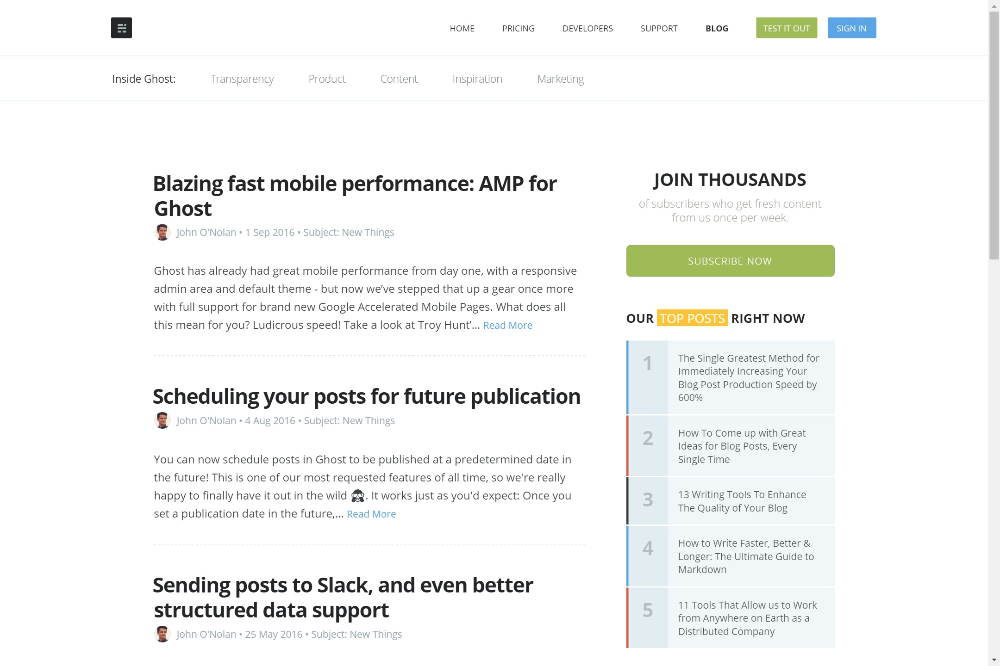

It's been a while, huh? Well, Welcome to the new face of **Glaciate**! In a newfound attempt to keep myself up-to-date in both writing skills and web development, I decided to write my own blogging system from the ground-up.

I've decided to call this blogging system **Icy Blog** (creative, right?). Made with NodeJS, but nothing fancy going on with posts: everything is stored in git, and all of the posts are formatted as Markdown *(with a JSON segment that allows me some flexibility later on for features such as tagging)*. Commenting is powered by Disqus, and I'll certainly open-source it when I'm happy with it.

*Ghost was a pretty heavy inspiration. Probably wouldn't have got things half as nice without it.*

The design of the site is a heavy mish-mash of various sites, ranging from the default WordPress theming to [Ghost](https://blog.ghost.org/) to [webapplog](http://webapplog.com/). So far, along with the aforementioned tagging system, I plan to add support for static pages and an automatically populating RSS/Atom feed. A mailing list would have been nice too, but there's no server persistence to speak of, so...

Anyway, this time around, I'm making things around here on a *more personal level*. Some of the stuff I might post may not even be relevant to application/game development. Is this a personal blog? It probably is now. 

We'll see!

