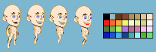

The pre-requisites are pretty simple; the game must have a GUI, must implement the MVC design pattern *(not really sure how this is applicable to games, but eh)*, consider ethical/security implications and make use of at least one of
- Online Gameplay
- a Physics Engine
- Collision Detection
- Multithreading
- Artificial Intelligence

The project that I've decided on is one that I've had plans for quite a while now, and it seems like a good way to kick myself into getting a prototype out there.

# The Elevator Pitch
The game I've started (henceforth referred to as "Untitled") will be an online Life Simulation game, akin to Animal Crossing.

The target demographic are 22-30 year olds looking for a laid-back online game to play where players can play at their own pace.

The gameplay will largely depend on social interaction: up to 8 players will be allocated a randomly generated island to live on and given their own house.

For the prototype, I intend to alow players to opt to collect furniture and decorate their house, landscape their island, catch/watch wild animals and style their characters.

Players will also be able to travel to any other island to visit players. The world functions in realtime: flowers and trees will continue to grow while players aren't logged in.

In order to ensure I meet the deadline, I will be developing features iteratively in order of what I determine neccessary to Unnamed (which this development log will detail).

While Unnamed is pretty heavily inspired by Animal Crossing the unique selling point is that it offers all this completely online; social interaction is the focal point of Unnamed.

# Asset Consideration & Programming

Unnamed will be in 2D. I started on a sprite for the fun of it and came to the above palette of 32 colours (that I refined from 54 colours!) which offers a good mix of the brown/green colours I needed. 

In terms of audio; an in-game day will be 6 hours (so an in-game hour take 15 minutes). While I plan to have hourly music like in Animal Crossing, resulting in 24 music tracks + potential music track for main menu.

I realise that this is not feasible to reach a deadline, so it is likely that I will source random placeholder music.

I will be making Unnamed with C# and MonoGame as it I've been programming with C# for several years and am already familiar with MonoGame; I see no reason to reinvent the wheel.
