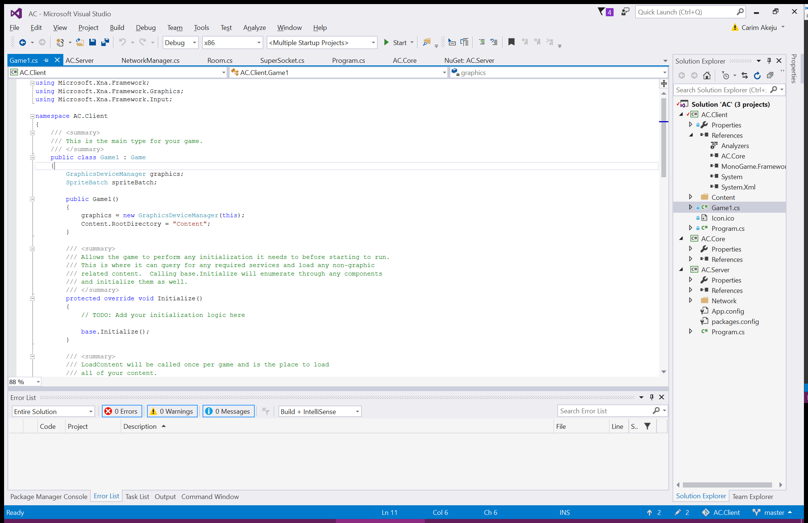
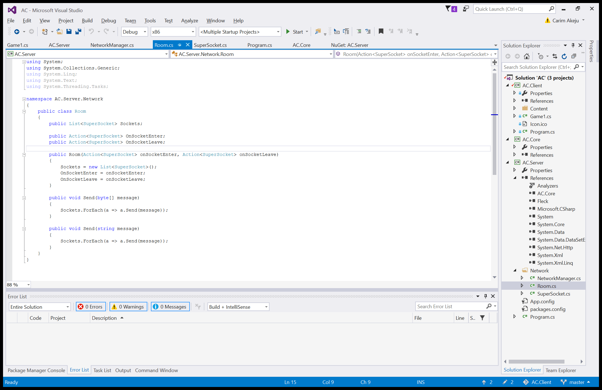

Like any old programming project, we have to start from actually...making a project! Now, because Unnamed will be an online game, we'll need more than one project. There are three projects in total:

1. The client: effectively a view for taking data from the server and passing input back.
2. The server: the thing that the game logic will actually run on, alongside storing player data and islands.
3. The core: functionality that is shared between the client/server and can function interoperably so a client with different specifications could possibly be made at any time.

*You can see that some stuff is done already: I write these things at the _end_ of the day, you know!*

The server is just a standard console application and the core will just be a library. The client itself is a DirectX MonoGame project for Windows. Both the client and server reference the core. 

[I've made it pretty clear in the past that I like using NodeJS](/article/the-making-of-icy-blog/), however, there are two reasons on why I've decided to not make both the client/server in NodeJS:

1. I didn't want to spend too much time on database implementation; C# lets me just serialise an object and store it as a file.
2. I needed both speed and abstraction as the server will potentially handle a lot of separate island instances and C# provided a good middle ground.

For networking, I've opted to use Fleck: a Websocket server library. The main reasoning was to keep it open-ended so I could potentially make a client with Javascript/WebGL at some point. For my first task, I spent about 20 minutes just abstracting some features that I appreciate from socket.io; rooms. Because there will be multiple independant islands, keeping it as manageable as possible to separate data is a worthwhile time investment.

*The rooms hold a reference list to all sockets and provide an event for sockets joining/leaving. This also allows me to easily implement chatrooms or additional instanced functionality later on.*

With the socket connection and handling pretty quickly taken care of, I started off with the server gameloop. This is where I thought about how I wanted to implement the actual interaction between the client and server. There are three ways I could go about doing this:

- I could let each client handle their own input and collision and send data to the server. The downside is that this very easily enables cheating and potentially different framerates could make collision detection/resolution behave inconsistently, however, I debated whether this would actually be important for a game of this nature. It seemed like something that moderation could take care of (in that very few people would know how to spoof location, anyway). 
- I could have the client send *only* input to the server and the server would process all movement and collision and send data back. The big downside to this is that there will always be a slight delay and it becomes a problem even worse with more latency. 
- Same impementation as the above, but also let the client process their own movement/collision and allow it to be corrected by the server when it disagrees. The best possible solution, but will be tricky to implement correctly.