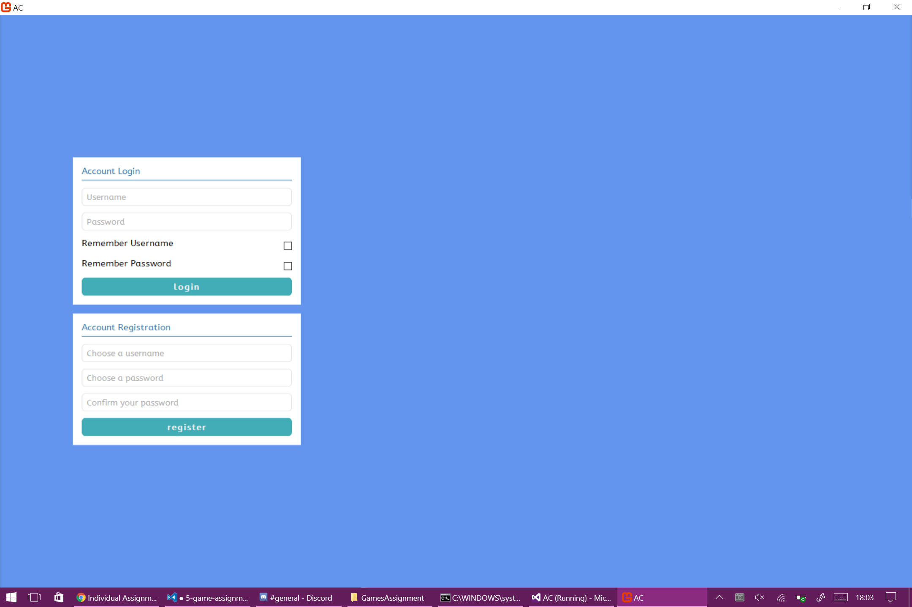

There are a lot of things to love with MonoGame (and by extension, C#). Interfacing is not one of them. By that, I mean, there is absolutely nothing that MonoGame provides to deal with it, you must make use of an interfacing library or roll your own code...except, there are actually very few interfacing libraries for C# and the ones that do exist are either needlessly complex or completely lacking (but odd design choices make them difficult to extend to your needs).

For some time, I found relative success with Squid, a blackbox library where you provide the rendering implementation and gave it inputs and it would take care of the logic, and it sortof worked, but I met 2 issues:

1. The library wasn't actually very up-to-date and had some issues, and the developer behind it didn't seem to want to continue it 
2. Actually implementing UIs: all this time spent trying to come to an ideal solution meant that I had no real experience actually making a good game UI!

I thought hard about what I actually wanted in an interfacing library and came to the conclusion that I just wanted something that I could write in a HTML/CSS-like syntax to deal with styling and positioning and use events for interactable elements instead of constantly polling for weird edge-cases...so that's where I had the idea:

Why not just make the UI as a website?

# Enter Awesomium
[Awesomium](http://www.awesomium.com/) is a HTML UI engine. You pass a URL (whether it be over HTTP://, HTTPS:// or FILE://) and it generates an instance of Chromium and renders your webpage. [Actually integrating it into MonoGame turned out to be pretty easy](http://stackoverflow.com/a/23253942/6785373), just start it up in a new thread and let it do its own thing. Testing it out, I found it didn't impact performance much, so I shouldn't see issues later on.

It has a nice license: free-to-use until you make a certain amount of money (that you'd be perfectly happy to pay by that point, anyway). 

The only real issue is that it hasn't seen an update in a while and the developers have dropped off the face of the Earth, but it provides the features I need and is seemingly bug free. It's a teeny bit slow to load too, but that was pretty easily fixed by `body { opacity: 0; -webkit-transition: opacity 2s; }` and `<body onload="document.body.style.opacity='1'">` just fade it in nicely when it does load and the user is none-the-wiser.

*Looking pretty good! The CSS behaved nicely!*

Right now, that's a login screen being rendered in MonoGame and the various transition/animation effects I tried ran consistently at 60 frames per second, so I have no reason to believe that it would be an issue later on. I've finally found a nice middle ground!

Tomorrow, I'll be looking at actually integrating logging in and an account implementation.