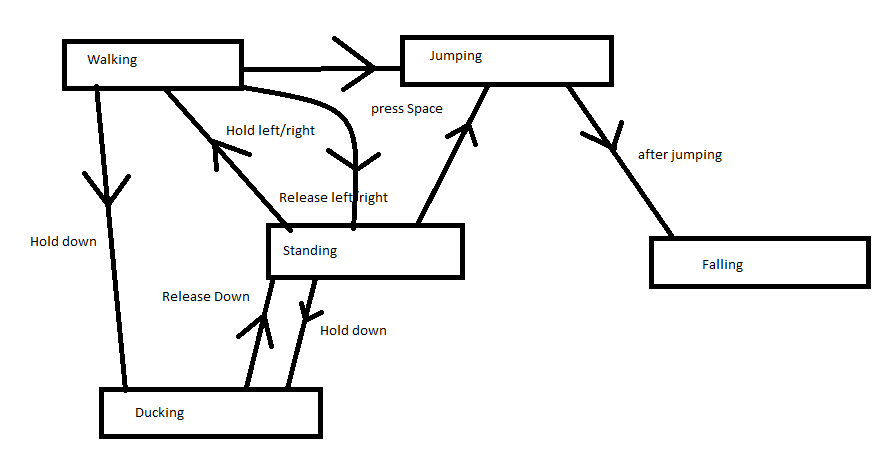

*All code examples are for C# with MonoGame. A .zip file is provided at the end of this article with a complete demonstration. The examples given in this article require a basic understanding of C#.*

# How do Typical Development Paradigms Fit?
When it comes to game development, it can be a bit harder for somebody who primarily focuses on application development to fully transfer their knowledge. With the inclusion of repeating logic centering around game loops, it may not come first nature to know how to write code that isn't so hopelessly *bug-prone*. 

Consider a platformer. We implement a character that responds to user input. Push the jump button and she should jump...but remember that we need to handle only a single jump or we could spam the jump button and jump forever!

To deal with this, you could have a flag as an If statement that is unset when the player lands. But then we want to add more actions such as ducking and walking, and each time something gets added, we end up with total spaghetti code and confusing bugs. 

Eventually it reaches a point where this approach simply doesn't work.

# An Introduction to the State Design Pattern
The state design pattern effectively implements a finite list of singular actions with identifiers. One action runs at a time, each action handles their own logic and nothing ever needs to intertwine, we simply tell a manager to switch to a different state as necessary.

*Technically, this is a finite state machine, but let's not muddy up the real issue at hand here.*

A state machine would consist of a context manager class that handles all information global to the state machine (such as current texture to draw or player position or animation frames) and a bunch of classes that inherit from a base interface that defines shared logic such as entering a state, exiting a state, updating and drawing methods.

State machines are useful for good models, particularly when either an entity has behaviour that changes based on an internal state, which can then be easily divided into a relatively smaller number of distinct options or the entity in question responds to a series of inputs and events over time.

# Defining a State Machine

The context manager, defined here as `class StateMachine` holds the aforementioned "list of singular actions with identifiers" (defined here as `Dictionary States`).

```
public class StateMachine : DrawableGameComponent where T : class, IState, new()
{
    public Dictionary States { get; private set; }
    private T _CurrentState;
    public string CurrentStateID;
    
    public new MainGame Game { get { return (MainGame)base.Game; } }
    
    public StateMachine(Game game) : base (game) 
    {
        States = new Dictionary();
        _CurrentState = new T();
    }
}
```

*(You've probably noticed `MainGame Game { get { return (MainGame)base.Game; } }`. Suppose we take a blank MonoGame project, we've renamed Game1 to MainGame and made the SpriteBatch public in scope. The getter is just an easy access of getting the game instance as MainGame without needing to repeatedly cast)*

We should probably bring up `IState`.

```
public interface IState 
{
    void Enter(params object[] args);
    void Exit();
    void Update(GameTime gameTime);
    void Draw(GameTime gameTime, SpriteBatch spriteBatch);
}
```

This is the general template that every state will implement. We have `void Enter()` that will be called every time the state machine changes to this state (which is useful for initialising any relevant information), `void Exit()` that will be called every time the state machine changes from this state (which is useful for unloading and freeing up resources), `void Update()` which is called every update cycle and `void Draw()` which is called every draw frame and where every draw call should be handled.

Now, going back to `StateMachine`. We have yet to add the ability to add or remove states:

```
public virtual void Add(string id, T state) 
{
    States.Add(id, state);
}

public virtual bool Remove(string id) 
{
    return States.Remove(id);
}
```

Simple enough. We just abstract over the native `Dictionary` implementation that .NET provides. Now we need to actually be able to change states.

```
public virtual void Change(string id, params object[] args) 
{
    _CurrentState.Exit();
    T next = States[id];
    next.Enter(args);
    _CurrentState = next;
    CurrentStateID = id;
}
```

Also simple enough! We call `void Exit()` for the old state, set the new one to the current state and call `void Enter()`. We can also pass in optional parameters that can be used for initialising various conditions.

Finally, as the state machine inherits `DrawableGameComponent`, it needs to update and draw the current state.

```
public override void Update(GameTime gameTime) 
{
    _CurrentState.Update(gameTime);
    base.Update(gameTime);
}

public override void Draw(GameTime gameTime) 
{
    _CurrentState.Draw(gameTime, Game.SpriteBatch);
    base.Draw(gameTime);
}
```

As far as the main state machine goes, that's it! You simply inherit from it if you need to for more specific functionality otherwise this solution is ready to use for anything ranging from player states to game menu management.

# Let's Make a Prototype!

To start, we'll want to define our Player.

```
public class Player : StateMachine
{
    public Vector2 Position;
    public Vector2 Velocity;
    
    public Texture2D CurrentTexture;
    
    public Player() : base(null) { throw new NotImplementedException(); }
    public Player(Game game) : base(game) { }
    
    public override void Initialize()
    {
        Position = new Vector2(400, 400);
    }
    
    public override void Draw(GameTime gameTime)
    {
        Game.SpriteBatch.Begin();
        Game.SpriteBatch.Draw(CurrentTexture, Position, new Rectangle(0, 0, CurrentTexture.Width, CurrentTexture.Height), Color.White, 0, new Vector2(CurrentTexture.Width / 2, CurrentTexture.Height), 1f, SpriteEffects.None, 0);
        Game.SpriteBatch.End();
        base.Draw(gameTime);
    }
}
```

To start, we just have our class inherit from our previous `StateMachine`. All of the states will implement a base abstract class `PlayerState`, which has in turn inherited `IState`.

We will also store the current player position and current player texture here. 

Not shown are a bunch of `Texture2D`s that hold each texture; refer to the .zip demo available at the end of the article.



For this prototype, we'll have players standing, walking and jumping (and by extension, we'll need a state for falling). Within Initialize, we can add

```
    Add("stand", new StandingPlayerState(this));
    Add("walk", new WalkingPlayerState(this));
    Add("jump", new JumpingPlayerState(this));
    Add("fall", new FallingPlayerState(this));
```

Before we tackle the individual specific states, let's look at `PlayerState`.

You may have wondered about the following:
1) Why would each state inherit from `PlayerState` instead of outright inheriting from `IState`?
2) How is jumping handled during both standing and walking or horizontal movement dealt with while grounded and in the air without duplicating code?

This is where `PlayerState` comes in. By making use of inheritance, we can have said 'duplicated code' in a single place.

```
public class PlayerState : IState 
{
    public Player Parent;
    
    public PlayerState() { }
    public PlayerState(Player parent) { Parent = parent; }
    
    public virtual void Update(GameTime gameTime) 
    {
    
    }
}
```

`Player Parent` is one of the primary reasons for inheriting from `PlayerState` instead of `IState`. By holding an instance of the player object, each state can individually directly change anything in the `Player` without any further interaction.

Let's start with standing.

```
public class StandingPlayerState : PlayerState 
{
    public StandingPlayerState(Player parent) : base(parent) { }
    public override void Enter(params object[] args) {
        Parent.CurrentTexture = ;
        base.Enter(args);
    }
}
```

This is pretty easy, we have nothing going on here. All that happens is that when we enter this state, the current sprite displayed should be changed to a standing one. Onto walking!

```
public class WalkingPlayerState : PlayerState
{
    public WalkingPlayerState(Parent parent) : base(parent) { }
}
```

Huh? There's nothing here? Well, the PlayerState class itself is going to deal with actual horizontal movement for us. This will just hold animation changing. Go look at the example!

Let's jump!

```
public class JumpingPlayerState : PlayerState 
{
    private float _MaxJumpTimer;
    public JumpingPlayerState(Player parent) : base(parent) { }
    
    public override void Enter(params object[] args) 
    {
        Parent.CurrentTexture = ;
        _MaxJumpTimer = 0.35f;
        base.Enter(args);
    }
    
    public override void Update(GameTime gameTime)
    {
        KeyboardState ks = Keyboard.GetState();
        Parent.Velocity.Y -= 5f;
        
        if (ks.IsKeyUp(Keys.W))
        {
            Parent.Change("fall", 0.35f - _MaxJumpTimer);
        }
        
        _MaxJumpTimer -= (float)gameTime.ElapsedGameTime.TotalSeconds;
        if (_MaxJumpTimer < 0f) 
        {
            Parent.Change("fall", 0.35f);
        }
        
        base.Update(gameTime);
    }
}
```

There's a bit going on here, we finally have our first bit of user interaction! While the W key remains pressed, the user will continue rising in the air. The moment they let go, they start falling. In the change, the first parameter given is a timer for falling to match the time spent in the air.

As an added note, please don't use time for an actual jumping/falling implementation, instead use inertia.

Now that we have jumping, we have to fall!

```
public class FallingPlayerState : PlayerState
{
    private float _MaxFallTimer;
    public FallingPlayerState(Player parent) : base(parent) { }
    
    public override void Enter(params object[] args) 
    {
        Parent.CurrentTexture = ;
        _MaxFalLTimer = (float)args[0];
        base.Enter(args);
    }
    
    public override void Update(GameTime gameTime) 
    {
        Parent.Velocity.Y = 5f;
        
        _MaxFallTimer -= (float)gameTime.ElapsedGameTime.TotalSeconds;
        
        if (_MaxFallTimer < 0f) 
        {
            Parent.Change("stand");
        }
        
        base.Update(gameTime);
    }
}
```

Here, we just do the opposite of jumping. It's worth noting that normally, collision would be a factor (hence why to not use time-based jumping) and it's possible for a fall to end sooner. 

Anyway, let's return back to `PlayerState`.

```
public virtual void Update(GameTime gameTime) 
{
    KeyboardState ks = Keyboard.GetState();
    Parent.Velocity.X = 0;
    
    if (ks.IsKeyDown(Keys.A)) 
    {
        Velocity -= new Vector2(5, 0);
    }
    
    if (ks.IsKeyDown(Keys.D))
    {
        Velocity += new Vector2(5, 0);
    }
    
    if (ks.IsKeyDown(Keys.W)) 
    {
        if (!(Parent.CurrentStateID == "jump" || Parent.CurrentStateID == "fall"))
        {
            Parent.Change("jump");
        }
    }
    
    Parent.Position += Velocity;
}
```

And that's it! We should now have a functional prototype where you can walk and jump along a flat plane using the WAD keys. How could this be further expanded on?

The code example at the bottom has a few more differences but nothing is fundamentally different; it should still be easy to understand in the context of this article.

# Flaws and Workarounds
Sometimes you may find that you need shared logic between many states. The prototype above demonstrated that this can be circumvented by inheriting from a base class that can run the shared logic, but this is not always ideal.

Let's say that beyond the platformer logic of our character, we wanted them to be able to attack from any state which increases the animations and transition permutations twofold. Instead, you may find that you need a second state manager to handle a completely different category of actions.  

This is referred to as a Concurrent State Machine: two or more state machines would receive the same update/draw calls and the same input and still remove the need for anything to interact with each other.

# Other Applications
This was mentioned a bit earlier, but this same pattern can be used to easily implement a menu: states could range from the title screen, a level select screen and the game. Maybe press escape at any point and you would transfer to a pause menu?

The structure of the state machine implementation also lends to help you: `void Enter()` provides an easy location to load assets and generate a level state.

Artificial Intelligence is also a big subject: good AI tends to be very expensive to compute, so complex state machines can allow us to make "smart enough" AI that is also computationally cheap. 

The states would be represented as various conditions such as distance to player character or own health or player health and their behaviour would change accordingly.

# Conclusion
To conclude, the state design pattern is a very important aspect of game development that can save a lot of time and headaches. It is very important that we recognise when it is a good idea to use a state machine, but that doesn't mean we should discount just how flexible one can be.

[*Download the example code (125 KB)*](https://tinyurl.com/zs7k4dl)

# Sources
1) [Game Programming Patterns - State Design Pattern](www.gameprogrammingpatterns.com)

2) [Learning Python Design Patterns](https://www.packtpub.com/application-development/learning-python-design-patterns)

3) [Source Making - State Design Pattern](https://sourcemaking.com/design_patterns/state)