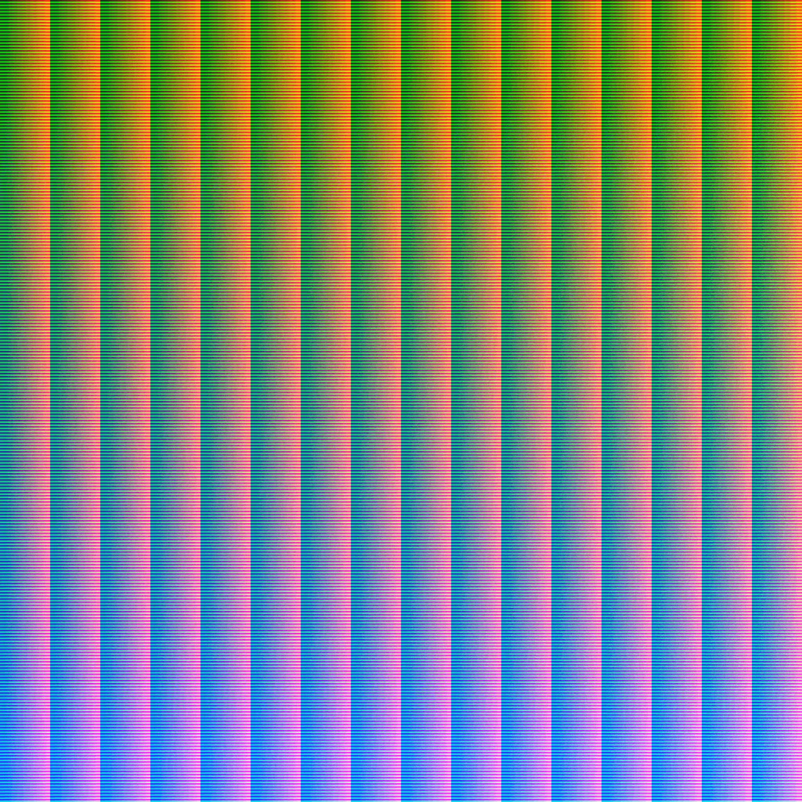
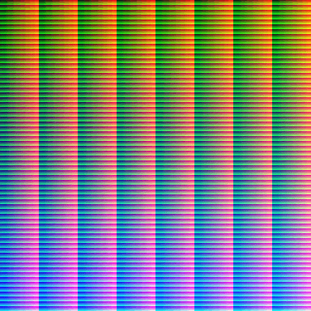

Hello! It's been quite a while. I've been trapped in this cycle of trying to figure out what to write, finding it not good enough and then just deferring what to write even longer and I can't say it's been a great move. Before I move on to the topic, I'll put a little update:

- I have started my final year and my honours project! It revolves around natural language parsing and I will surely write more on that in time.
- I've been doing occasional streams varying between gamedev and academic. I also updated the site to display when my stream is live some time ago.
- I picked up Super Mario Odyssey! Here's how good it is: it's like Super Mario 64 and Banjo Kazooie and I _despise_ both. I love Super Mario Odyssey! Just about everything about it is a treat. I stream it occasionally.
- Weekly roundups (clearly) don't work for me so I'll just stick to doing updates when I can!

Okay, that about covers it. Now, onto the actual topic of the day!

# Newer Hardware With Less Features?

Now, this is going to be grossly oversimplified because I don't particularly care for the fine-details myself, but once upon a time, computer graphics used to be pretty...primitive. Let's take the NES. The NES had a special chip called the Picture Processing Unit which was pretty dang good at managing memory to store graphics. It provided full sprite support, moving backgrounds and could display many colours (for the time). 

It supported a total of 54 colours, each of which could be tinted meaning there was a total of 432 colours that were available. The problem is, it could only select 4 of these at a time with each sprite. Transparency also counted as its own colour.

Graphics didn't exist as we know them now: they weren't blocks of memory of raster graphics, they were hardcoded set values with memory assigned for colour palettes. One cool thing that could be done with this was palette shifting.

*(Yes, I know, Shovel Knight isn't a NES title, but there's a surprising lack of NES-like palette shifting examples on the internet!)*

Fast forward to today where we have dedicated GPUs with hundreds of processor cores, each able to do parallel processing (As a result, they are able to draw triangles and interpolate colours _incredibly_ quickly) and so much memory that all of these concerns of the past are laughable.

With this came a change in how images were represented: graphics are actual raster graphics with each pixel representing a colour rather than an index from a palette table. Because of this, one feature of the past has totally disappeared.

# Prototypes ≠ Good Design

So, on a modern system, there's only really one _efficient_ way that you can accomplish this: with shaders. So I opened up MonoGame and wrote a HLSL shader to try to work out how this might work. The problem...well, let's walk through the process.

- We'd get a list of colours for our palette and pass them to the shader in an array.
- For each colour, we'd look at the "distance" of the current pixel colour from the current selected palette colour.
- If it was the "closest" colour, that would get set to the current pixel colour. Repeat for the remaining colours in the palettes.

The problems become evident:

- There's a lot of branching logic with if-statements which is a big no-go for performance.
- There are a lot of comparisons that, frankly, don't need to happen.
- The way "distance" is calculated works by converting the colour from RGB to Lab colour space, which only does so much more needless taxing calculations.

And countless more. This wouldn't run effectively on low-end systems and I could completely forget about using such a shader on mobile: I'd just completely eat whatever battery the system had.

# Mapping Colour Space

As I worked through the logic, a better functionality became evident: instead of working with a palette, I could work with a colour space that had been pre-computed with the palette itself, as in, for each possible red/green/blue combination, a pre-calculated colour from the palette that was found to have been the closest would be used. This information can quite handily be baked into a texture.

Right off the bat, there are a few problems; first we'd need to represent 3 dimensional data (red, green and blue) in a 2d image; trying to use a 3D texture seems rather...wasteful. Actually projecting this data is pretty simple: `[ x', y' ] = x + width * (y + depth * z)`.

Now there's another problem. If we try to represent red/green/blue as-is, we'd be needing a 256 x 256 x 256 space; a total of 16,777,216 pixels to represent each possible colour. We'd need a 4096 x 4096 px image to represent this, and I did exactly that.

Now, modern computers would probably sniff at something like this...but I did want this solution to work efficiently on mobile too. Need something a _bit_ less heftier than that.

To solve that, I used a 64 x 64 x 64 space and mapped each colour from 0 - 255 to 0 - 63. This requires a total of 262,144 pixels to represent each colour: 64 times less than the original texture, and quite handily represented in a 512 x 512 px image.

Of course, this is no longer a perfect solution: we now lose a bit of precision but I've decided that the amount we'd lose is so minimal that I can choose to not care.

Now that we have a texture, I can pass it through Photoshop, apply colour indexing and let it do the job for me.

I've used the DawnBringer 32 palette here. I think it has good and accurate representation for each possible colour.

Finally, we make a new HLSL shader. In this one, we pass in our new pre-computed texture, find where the current pixel colour would have been on this image and use that as the new current pixel colour. No needless comparisons and a nice, happy and workable solution for mobiles.

Now, this by itself doesn't do any palette shifting, but there are a number of options here: 
1) We could render to the scene as normal, but say, with a translucent black overlay for menu transitions. Because the colours there are changing, we then get the effect of palette swapping.
2) We could pre-compute several other textures for different palettes and just swap the textures as needed. A 512x512 texture isn't particularly stressful on either computation or memory.

Thanks for reading!
